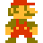
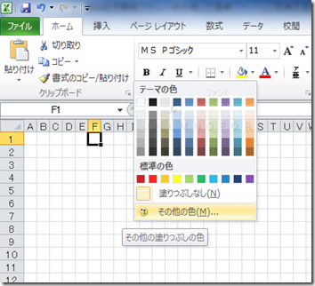
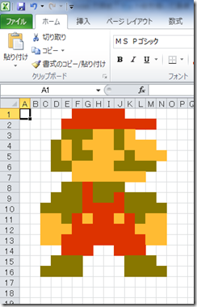
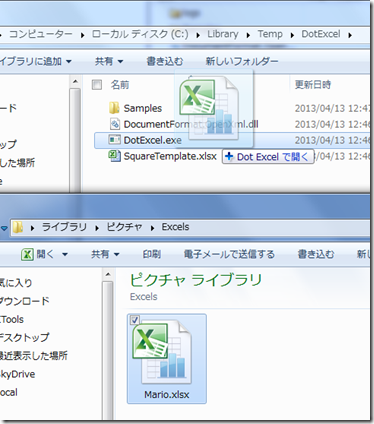
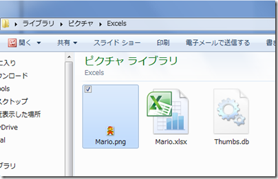
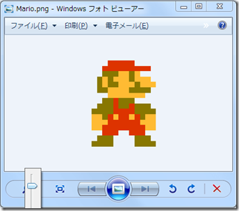

## Dot Excel
Dot Excel は、Excel 方眼紙に描かれたドット絵を画像ファイルに変換するためのツールです。



以下では、Dot Excel を利用するための手順について記述します。

### 1. Excel 方眼紙にドット絵を描く
Excel ファイルの最初のシートを方眼紙に設定します。  
(変換の対象となるのは、最初のシートのみです。)

[塗りつぶしの色] – [その他の色] で色を選択して、セルの背景色を設定していきます。  


ドット絵を描き終えたら、ファイルを保存します (拡張子は .xlsx)。  


### 2. Excel ファイルを画像ファイルに変換する
エクスプローラーまたはコマンドラインでの操作により、ファイルを変換できます。

#### 2.1 エクスプローラーでの操作
エクスプローラー上で Excel ファイル (複数可) をドラッグして、DotExcel.exe にドロップします。  


すると、PNG ファイルが作成されます。  
塗りつぶしが設定されなかったセルの部分は透明になります。  



#### 2.2 コマンドラインでの操作
##### 構文
```
    dotexcel "file1" ["file2" ...] [/format:png](jpg_jpeg_bmp_gif_tif_tiff_ico)
```
または
```
    dotexcel toimage "file1" ["file2" ...] [/format:png](jpg_jpeg_bmp_gif_tif_tiff_ico)
```

複数の Excel ファイルを指定できます。絶対パス・相対パスのどちらでもかまいません。  
/format オプションを指定することにより、PNG, JPEG, BMP, GIF, TIFF, ICO 形式に変換できます。  
既定は PNG 形式です。  


### 3. その他
##### 動作環境
* Excel 2007 以降
* .NET Framework 4 以降

##### 注意
今後のバージョンで機能が追加された場合、操作方法が変更される可能性があります。

##### 追加される予定の機能
* 画像ファイルを Excel 方眼紙のドット絵に変換する。

##### 参照
* [Excel 方眼紙でドット絵を描く](http://sakapon.wordpress.com/2013/04/15/dotexcel/)

##### ライブラリなど
Dot Excel は、次のライブラリを利用しています。
* [Open XML SDK 2.5](http://www.microsoft.com/en-us/download/details.aspx?id=30425)
